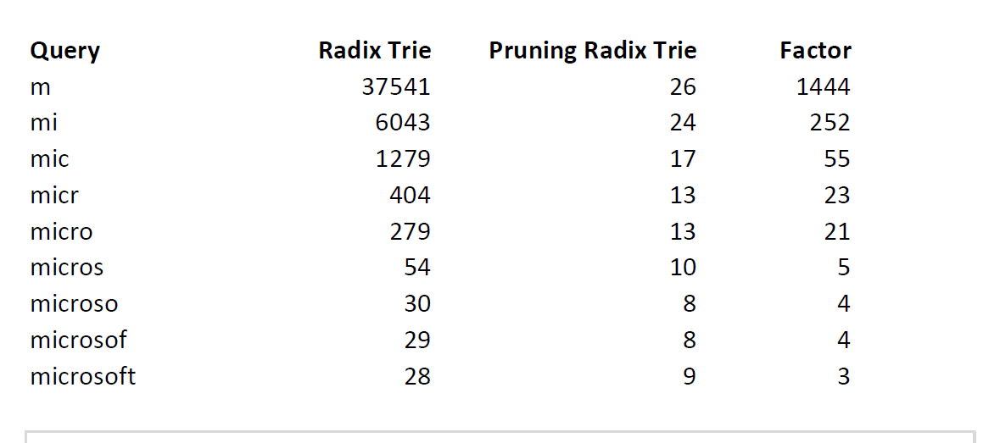

# Search for products with autocomplete suggestions 
<b> Market Benefit:  </b>
Implementing product search with autocomplete offers real-time suggestions based on user input, thus improving navigation efficiency in our grocery delivery application and enhancing user experience. 
### Implementation:
<b> 1. Trie: </b> 
<b>Why this works?  </b>
 - Trie allows for efficient insertion and retrieval operations, making it ideal for storing and searching product names or keywords used in autocomplete and search functionalities of your grocery delivery application.
 - It enables alphabetical filtering, which is useful for categorizing and searching products by their names or categories.
 - It supports efficient prefix search and longest prefix matching, facilitating quick autocomplete suggestions and accurate product search results.
 - It supports ordered iteration, ensuring that product names are accessed in a predictable sequence, which can be beneficial for displaying search results or product listings in a user-friendly manner.  
<b>Limitations  </b>
 - Tries can consume significant memory, especially when storing large datasets of product names.
 - An efficiently constructed hash table(i.e. a good hash function) has O(1) as lookup time which is way faster than O(l) in the case of a trie, where l is the length of the string.   
<b>Analyzing complexity </b>
 - Time Complexity: O(number of words * maxLengthOfWord)
 - Auxiliary Space: O(number of words * maxLengthOfWord)
 - For searching, time complexity is O(k) where K is the number of letters typed  
 [Click to analyze code](./Codes for portfolio/trie.cpp)
  
<b> 2. Pruning Radix trie </b> 

 <b>Why this works?</b>
 - It is up to 1000 times faster than an ordinary Radix Trie, making it ideal for providing instant autocomplete suggestions to users as they type in product names.
 - Its space-optimized structure ensures efficient use of memory. This is important for handling large dictionaries of product names and categories in a grocery delivery application.
 - By storing the maximum rank of all children in each node, the Pruning Radix Trie can quickly return the top-k most relevant results.   
<b>Analyzing complexity </b>
 - It reduces the tie complexity for serching of a radix trie by a factor of 1000.  
[Click to analyze code](https://github.com/otto-de/PyPruningRadixTrie)

  
  

  

[Back](README.md#applying-dsa-to-achieve-key-functionalities)

