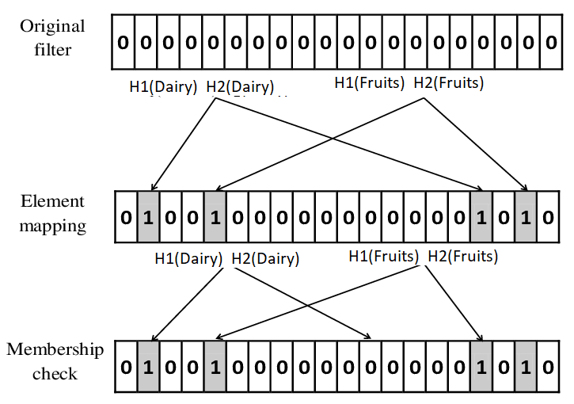

# Tracking user preferences across different product categories
<b> Market benefit: </b>
In a grocery delivery application, customers interact with various categories or types of products. To enhance the user experience and improve customer satisfaction, tracking user preferences can provide insights that can be used for demand forecasting to restock inventory and segment customers for targeted promotions, etc.  

### Implementation:  
<b> Bloom filter </b>  
<b> How it works? </b>
- When a user interacts with a product category (e.g., views or adds to cart), their preference is recorded in the Bloom filter.
- Inserting an element into a Bloom filter involves computing multiple hash functions and setting the corresponding bits in the filter array.
- When generating recommendations, the Bloom filter checks if a product category's identifier exists for a particular user by computing the hash function and checking corrsponding bits.
- The Bloom filter requires an array of size 𝑚, where each bit represents the status (set or unset) of a hash function output for each item stored.  

  

<b> Why this works? </b>
- They enhance the speed of retrieving and processing user preferences and interactions, i.e. quickly check if a user has interacted with a particular product category without directly accessing the disk. 
- Bloom filters have a substantial space advantage over other data structures for representing sets, such as self-balancing binary search trees, tries, hash tables, etc. Most of these require storing at least the data items themselves, which can require anywhere from a small number of bits, for small integers, to an arbitrary number of bits, such as for strings. Bloom filters do not store the data items at all, and a separate solution must be provided for the actual storage.   

<b> Limitations</b>
- Bloom filters can occasionally produce false positives, indicating that a user is interested in a category when they are not.
- Bloom filters only provide a probabilistic indication of membership, not the actual data itself.
- The greater the number of hash functions, the slower the Bloom filter. However, if you have a small number, you may experience excessive false positives.   

<b> Analyzing complexity </b>
- Time complexity: During entry and search, it is 0(k), where k is the maximum number of hash functions implemented.
- Space complexity: 0(m), wherein m is the expected number of items (product categories)   
[Click to analyze code](https://www.sanfoundry.com/cpp-program-implement-bloom-filter/#google_vignette)
  

[Back](README.md#applying-dsa-to-achieve-key-functionalities)

